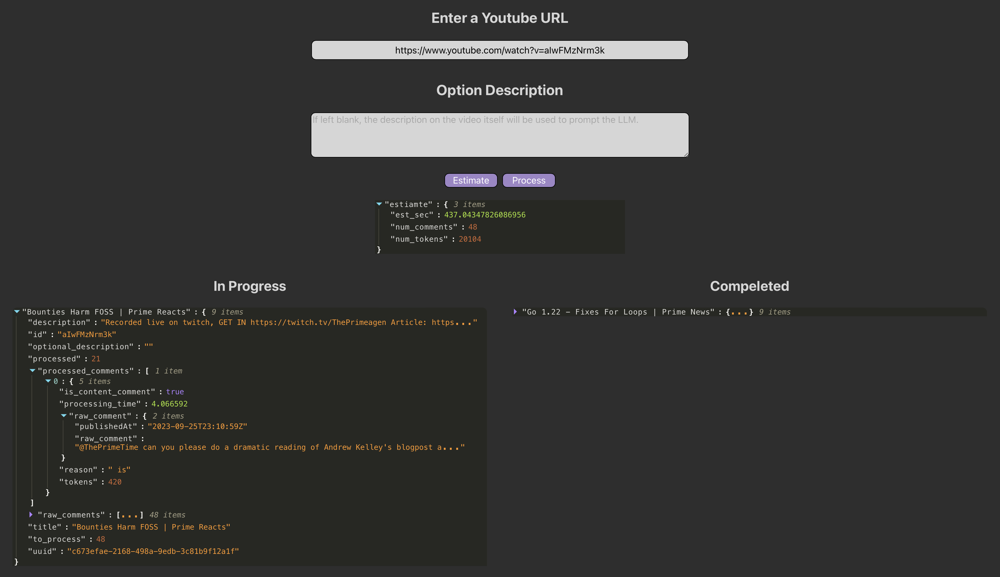

# Comment Content Aggregator

Go has problems building for arm

NodeJS has no Queue for decoupled worker messaging

Python Servers lack parallelism

Java - I'd rather be blind

C++ is slow to develop, but best looking option (using restinio for server else uWebsockets) (concurrentqueue for thread communication)
